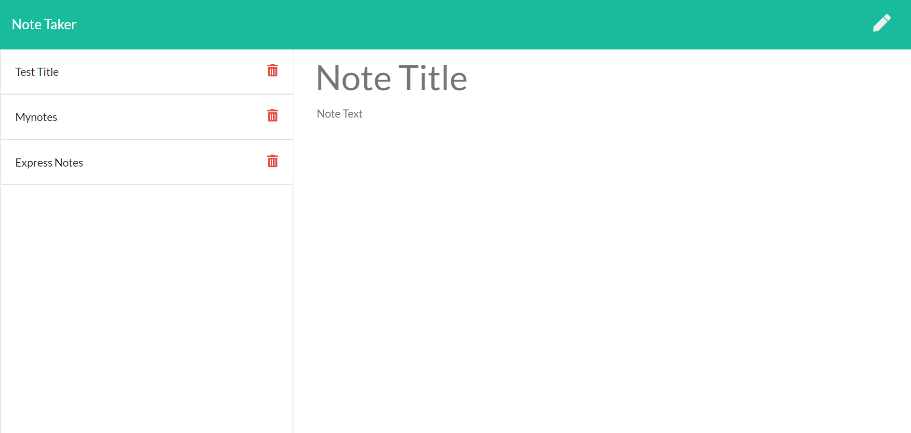

# Note-Taker

**Description**

The Note Taker application can be used to create, save, and delete notes to help the user organize their life and stay on top of tasks. The user can simply write a title and description for their note or task by typing this information in the "Note Title" and "Note Text" fields and clicking the save icon. Their list of saved notes will then appear on the left hand side of the application. The user can view any of their saved notes by clicking on the note they want to see and its details will appear in the main viewing section of the page. Additional notes can be created by clicking the pencil icon in the upper right hand corner, adding a title and new note description, and clicking save. Finally, if the user would like to remove a note from their list, they can do so by clicking the trash can icon on the list item they wish to delete.

